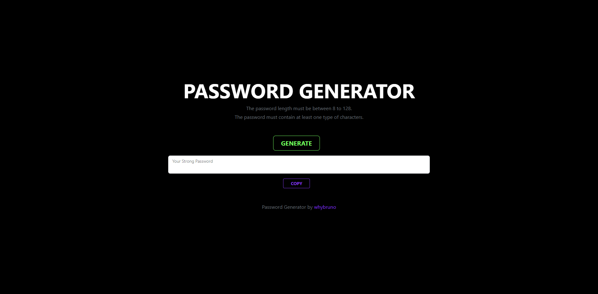

# :full_moon: About The Project

**Password-Generator** is a Web App to generate passwords between 8 and 128 characters, which can contain numbers, lowercase letters, uppercase letters and special characters. This is the challenge of the week at the **edX Front-End Web Development Bootcamp**.

# :waxing_gibbous_moon: Features

- JavaScript
- Bootstrap 5

# :first_quarter_moon: Screenshot

# :waxing_crescent_moon: Acceptance Criteria

- Code should validate for each input
- Generate a password when the button is clicked.
- At least one character type should be selected.
- Present a series of prompts for password criteria.
- Length of password at least 8 characters but no more than 128.
- Should be generated and displayed in an alert or written to the page.
- Character types (lowercase, uppercase, numeric and special characters).

# :new_moon: Technologies

- HTML
- CSS
- BOOTSTRAP 5
- JAVASCRIPT

# :globe_with_meridians: Website

- [Password-Generator](https://whybruno.github.io/password-generator)

# :copyright: Credits

N/A

# :registered: License

MIT License